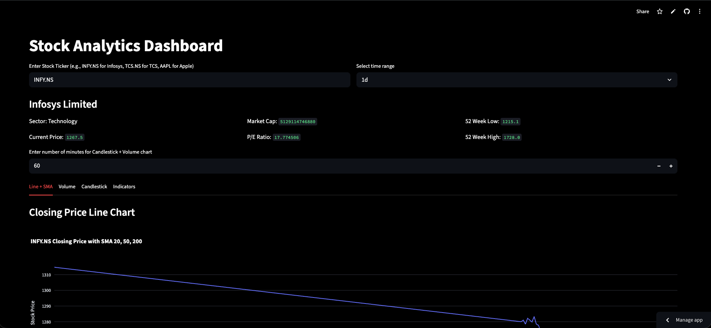
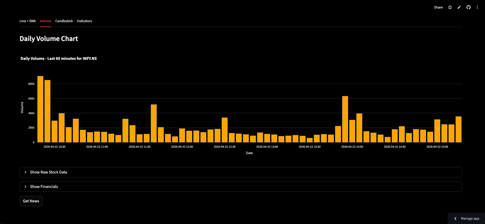
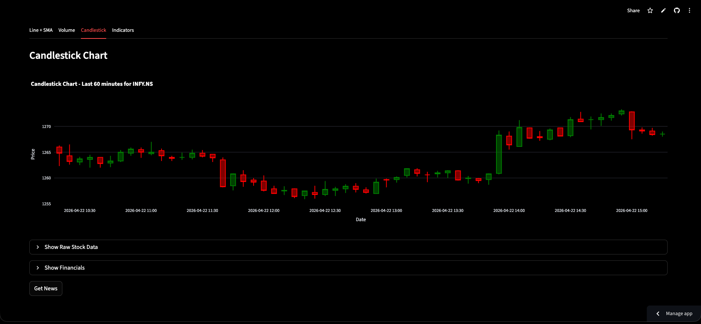
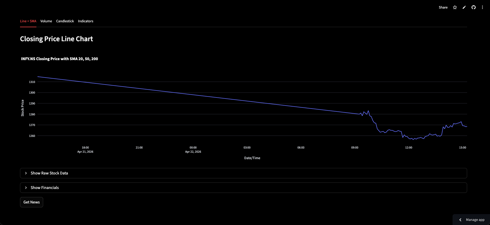
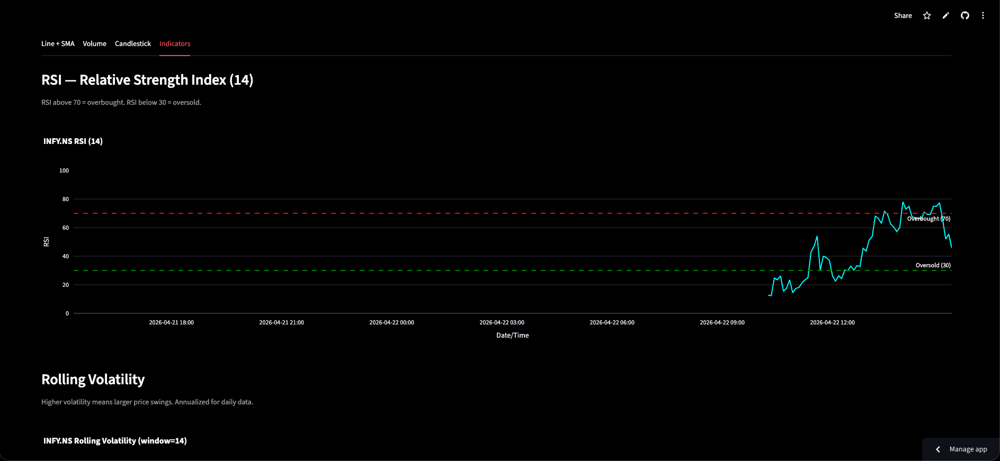
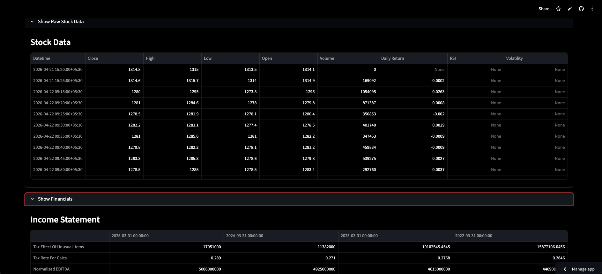
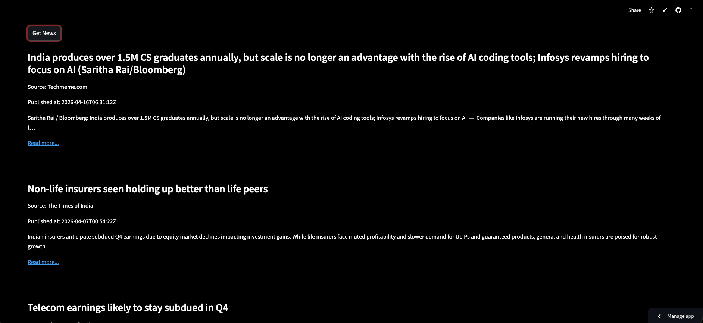

# Stock Analytics Dashboard

A real-time stock analytics dashboard built with **Python**, **Streamlit**, **yfinance**, and **Plotly**.  
The app lets users track any stock, analyze technical indicators, view financial statements, and read relevant company news — all in one place.

## Live Demo

[Live App](https://vansh-stockanalyticsdashboard.streamlit.app/)

## Features

- Real-time stock price data for any global ticker (NSE, BSE, NASDAQ, NYSE, etc.)
- Intraday and historical charts with smart interval mapping
- IST timezone conversion for accurate Indian market timestamps
- Line chart with SMA 20, SMA 50, and SMA 200 overlays
- Volume bar chart
- Candlestick chart
- RSI (Relative Strength Index) with overbought and oversold levels
- Rolling volatility with annualized calculation for daily data
- Daily return distribution histogram
- Company overview — sector, current price, market cap, P/E ratio, 52-week range
- Financial statements — income statement, balance sheet, cash flow
- Relevant company news via NewsAPI sorted by relevancy
- Safe error handling for invalid tickers and missing data
- Secrets managed for both local development and Streamlit Cloud deployment

## Tech Stack

- **Frontend / App UI:** Streamlit
- **Data source:** yfinance (Yahoo Finance)
- **Charts:** Plotly (graph_objs + express)
- **News:** NewsAPI
- **Configuration:** python-dotenv
- **HTTP:** requests
- **Timezone:** pytz

## Project Structure

```bash
.
├── Dashboard.py       # Main Streamlit app — UI, data, charts, indicators, news
├── requirements.txt   # Python dependencies
├── .env               # Local secrets (not committed)
├── .env.example       # Template showing required environment variables
└── README.md
```

## Installation

### 1. Clone the repository

```bash
git clone https://github.com/Vansh-Talwar/StockAnalyticsDashboard.git
cd StockAnalyticsDashboard
```

### 2. Create a virtual environment

```bash
python -m venv venv
```

Activate it:

**Mac/Linux**
```bash
source venv/bin/activate
```

**Windows**
```bash
venv\Scripts\activate
```

### 3. Install dependencies

```bash
pip install -r requirements.txt
```

## Environment Setup

Create a `.env` file in the project root:

```env
NEWS_API_KEY=your_newsapi_key_here
```

Get a free NewsAPI key from [newsapi.org](https://newsapi.org).

For **Streamlit Community Cloud**, add the key in the app's **Secrets** settings instead:

```toml
NEWS_API_KEY = "your_newsapi_key_here"
```

## Run the App

```bash
streamlit run Dashboard.py
```

Then open the local URL shown in the terminal.

## How It Works

### Data Pipeline

1. User enters a stock ticker and selects a time range.
2. The app maps the time range to the most appropriate interval automatically.
3. yfinance fetches OHLCV data using explicit start and end dates for full coverage.
4. The index is converted to IST for accurate Indian market timestamps.
5. Technical indicators are computed using pandas rolling windows.

### Interval Mapping

| Time Range | Interval | What You See |
|---|---|---|
| 1d | 5m | Full trading day in 5-min candles |
| 2d | 5m | 2 full trading days |
| 5d | 15m | Full 5 days in 15-min candles |
| 1mo | 1d | Daily candles for a month |
| 3mo | 1d | Daily candles for 3 months |
| 6mo | 1d | Daily candles for 6 months |
| 1y | 1d | Daily candles for a year |
| 5y | 1wk | Weekly candles for 5 years |
| max | 1mo | Monthly candles for full history |

### Technical Indicators

**SMA (Simple Moving Average)**  
Rolling mean of closing prices over 20, 50, and 200 periods. Used to identify trend direction and support/resistance levels.

**RSI (Relative Strength Index)**  
Momentum oscillator computed over a 14-period window. Values above 70 indicate overbought conditions. Values below 30 indicate oversold conditions.

**Annualized Volatility**  
Rolling standard deviation of daily returns multiplied by √252. Measures how much the stock price fluctuates relative to its average. Higher values indicate higher risk.

**Daily Return Distribution**  
Histogram of percentage daily returns. A bell-shaped distribution suggests returns follow a near-normal distribution, a standard assumption in quantitative finance.

## App Sections

### Line + SMA
Closing price line chart with optional SMA 20, 50, and 200 overlays depending on the selected time range.

### Volume
Bar chart showing trading volume for a configurable number of recent periods.

### Candlestick
OHLC candlestick chart with green candles for price increases and red for decreases.

### Indicators
- RSI chart with overbought and oversold reference lines
- Rolling volatility chart with area fill
- Daily return distribution histogram

### Raw Data and Financials
Expandable sections showing the raw OHLCV dataframe, income statement, balance sheet, and cash flow statement.

### News
On-demand company news fetched from NewsAPI, sorted by relevancy to the company name.

## Screenshots

- Interface  
  

- Volume Chart
  
  
- Candlestick Chart  
  

-  Line + SMA 
  
  
- RSI Indicator  
  

- Data and Income Statement  
  

- News 
  

## Future Improvements

- Add MACD (Moving Average Convergence Divergence) indicator.
- Add Bollinger Bands overlay on price chart.
- Add stock comparison feature for multiple tickers.
- Add portfolio tracker with weighted returns.
- Add unit tests for indicator calculations.
- Cache API responses to reduce redundant yfinance calls.

## Resume-Ready Project Summary

Built a real-time stock analytics dashboard using yfinance, Streamlit, and Plotly featuring intraday and historical price charts, technical indicator computation (SMA, RSI, annualized volatility), daily return distribution analysis, financial statement display, and company news integration via NewsAPI, with IST timezone handling and robust error management, deployed on Streamlit Community Cloud.

## License

This project is for educational and portfolio use.
